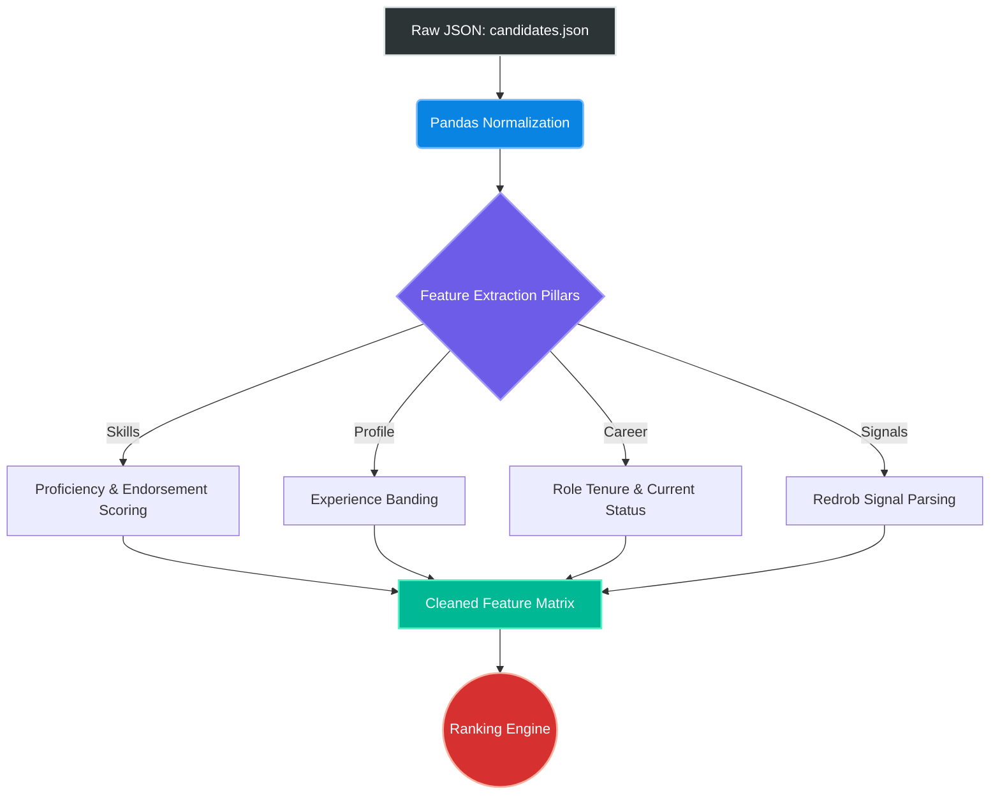
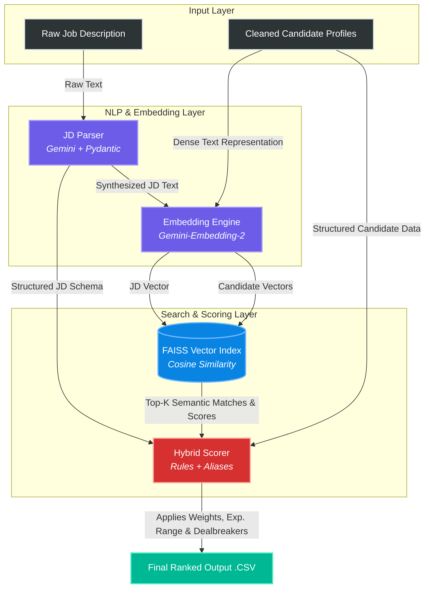
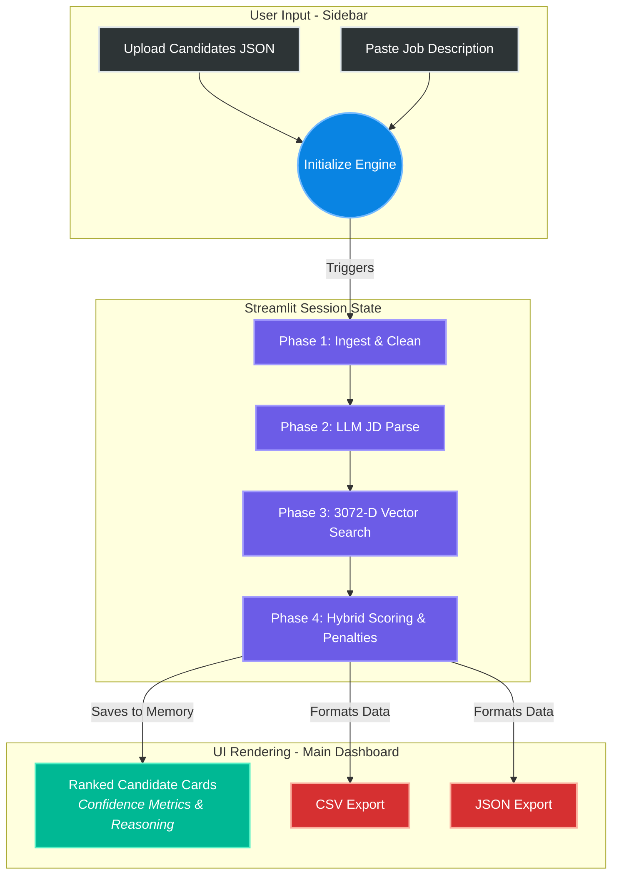
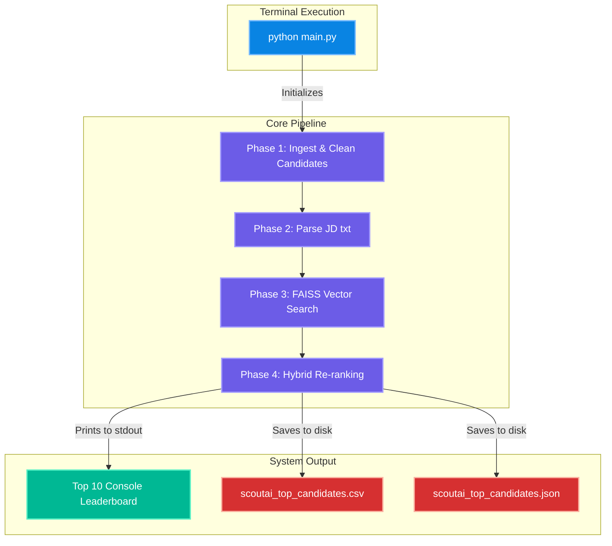
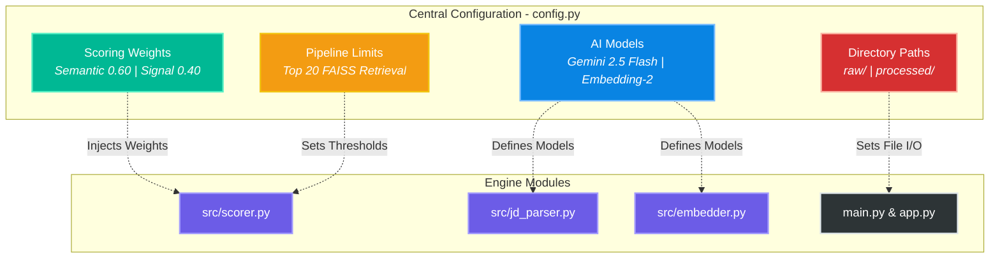

## 📊 Data Exploration & Processing (EDA)

Real-world candidate data is deeply nested and structurally complex. Before running the ranking algorithm, we perform rigorous data hygiene and feature extraction to build a clean evaluation matrix.

The exploratory data analysis (`notebooks/eda.ipynb`) executes the following pipeline:

1. **JSON Normalization:** Flattens the nested `data/raw/candidates.json` schema into a tabular format using Pandas.
2. **Schema Mapping & Null Handling:** Enforces strict checks for required fields (`candidate_id`, `skills`, `education`, `career_history`) and maps out missing values.
3. **Feature Engineering:** Extracts actionable metrics across four core pillars:
   * **Profile:** Calculates experience bands and normalizes current job titles and industries.
   * **Skills:** Evaluates not just skill presence, but aggregates proficiency levels, duration of use (months), and total endorsements.
   * **Career History:** Calculates role tenure (duration in years) and weights current versus past roles.
   * **Redrob Signals:** Parses proprietary hackathon signals for advanced candidate matching.

### 🏗️ Data Pipeline Architecture

## ⚙️ Core Engine Architecture (`src/`)

The ScoutAI ranking engine does not rely solely on basic keyword matching or pure black-box LLM scoring. Instead, it utilizes a **Hybrid Ranking System**, combining the semantic understanding of Google's Gemini models with high-speed FAISS vector search and strict, rules-based recruiter logic.

The backend is split into four primary modules:

### 1. `candidate_profiler.py` (Data Ingestion)
Transforms raw, unpredictable JSON into structured profiles. Crucially, it dynamically generates a dense `text_representation` for each candidate by synthesizing their profile, skills, career history, and projects into a single cohesive string optimized for vector embedding.

### 2. `jd_parser.py` (LLM Structuring)
Job descriptions are messy. This module uses **Gemini** and **Pydantic** to parse raw text JDs into a strict `JDProfileSchema`. It automatically extracts:
* Required vs. Preferred skills
* Minimum and maximum experience ranges
* Critical "deal-breakers"
* A synthesized embedding text for vector matching

### 3. `embedder.py` (Vector Search)
Powered by `models/gemini-embedding-2`, this module converts the synthesized candidate texts and JD profiles into high-dimensional vectors. We use a **FAISS Inner-Product Index (`IndexFlatIP`)** with L2 normalization to perform lightning-fast, scalable cosine-similarity searches to find the top semantically matched candidates.

### 4. `scorer.py` (The Hybrid Evaluator)
Semantic similarity is not enough (e.g., an LLM might confuse a Junior Data Analyst with a Senior Data Scientist because the vectors are close). The `HybridScorer` takes the Top-K FAISS results and re-ranks them using strict business logic:
* **Signal Scoring:** Evaluates precise matches for required/preferred skills (utilizing a massive built-in synonym/alias map to equate "JS" with "JavaScript" and "K8s" with "Kubernetes").
* **Experience Clamping:** Penalizes candidates who fall outside the parsed JD experience range.
* **Dealbreaker Penalties:** Applies aggressive mathematical penalties for missing non-negotiable requirements.

---

### 🧠 System Architecture & Data Flow

## 🖥️ Frontend & User Interface (`app.py`)

To make the engine accessible to recruiters and judges, ScoutAI includes a premium, interactive web application built with **Streamlit**. 

Rather than a standard, out-of-the-box layout, the UI is heavily customized using injected CSS to feature a **"Dark Liquid Glass"** aesthetic—utilizing glassmorphic sidebars, glowing cyan metrics, and custom HTML "skill pills" for an enterprise-grade feel.

### ✨ Key Application Features
* **Stateful Execution:** Utilizes Streamlit's `session_state` to cache the heavy AI ranking results in memory, ensuring the app doesn't re-run the entire pipeline when a user clicks the download buttons.
* **Real-time Pipeline Tracking:** Features an animated status box that walks the user through the 4-phase backend execution (Ingestion -> Parsing -> Vector Search -> Hybrid Scoring).
* **Rich Candidate Cards:** The top 10 candidates are rendered in expandable glassmorphic cards containing:
  * A glowing **Match Confidence** progress bar.
  * Explicit **AI Reasoning** explaining exactly *why* the candidate was ranked there.
  * A breakdown of core skills and career trajectory.
* **1-Click Export:** Generates the hackathon-required `output.csv` and a detailed JSON export instantly from the UI.

### 🔄 User Flow Architecture

## ⚙️ Headless Execution (`main.py`)

For pure pipeline testing without the web interface, ScoutAI provides a robust Command Line Interface (CLI) entry point[cite: 10]. 

`main.py` executes the exact same 4-phase architecture as the frontend application but runs entirely headless[cite: 10]. It outputs a clean, formatted leaderboard directly to the console and natively generates the required export files[cite: 10]. This is ideal for rapid local evaluation or server environments where a web UI is unnecessary.

### 🚀 Terminal Usage

Execute the pipeline directly from your terminal:
\`\`\`bash
python main.py
\`\`\`

*Note: Before running, ensure you have your target job description saved as a text file at `data/raw/jd.txt`*[cite: 10].

### ✨ Key Script Features
* **Automated Infrastructure:** The script automatically initializes the environment and ensures the `RAW_DATA_DIR` and `PROCESSED_DIR` directories are created[cite: 10].
* **Full 4-Phase Execution:** It seamlessly runs candidate ingestion, LLM job description parsing, 3072-D FAISS vector generation, and hybrid re-ranking[cite: 10].
* **Output Parity:** Automatically formats and saves the `scoutai_top_candidates.csv` and `scoutai_top_candidates.json` files directly to your root directory for easy submission[cite: 10].
* **Rich CLI Leaderboard:** Prints the Top 10 candidates directly to the terminal, complete with their match percentage, the AI's step-by-step reasoning for the score, and a curated list of their core skills[cite: 10].

### 🖥️ CLI Execution Flow

## 🎛️ System Configuration (`config.py`)

ScoutAI is designed to be highly modular. Rather than hardcoding hyperparameters into the ranking engine, all global variables, model selections, and directory paths are centrally managed in `config.py`. 

This allows recruiters or engineers to easily tune the system—such as adjusting the scoring weights to favor strict skill-matching versus broader semantic discovery—without touching the core backend logic.

### ⚙️ Core Parameters

* **Scoring Weights:** The engine balances AI semantic search (`0.60`) with rules-based recruiter signals (`0.40`). *(Note: These must sum to 1.0)*.
* **AI Models:** Powered by `gemini-2.5-flash` for job description parsing and `models/gemini-embedding-2` for generating the 3072-D vector embeddings.
* **Pipeline Limits:** The `TOP_N` limit dictates that the FAISS index retrieves the top 20 candidates before applying the intensive HybridScorer logic.
* **Directory Management:** Centralized control for the `data/raw/` and `data/processed/` data pipelines.

### 🧠 Configuration Data Flow

